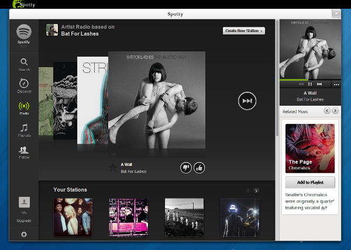

Spotty Gnome
============

Spotty is a GNOME app wrapping the [Spotify][spotify] web player to
provide media key support (play/pause, next and previous).

WebKitGTK+ 2 is required, which should be available in a recent GNOME
release (3.8).

Installing
----------

Clone this repository and then run `install.sh`. It will just create a .desktop
file in the appropriate location so that it has an icon and can be added to
favorites/menus.

Contributing
------------

Contributions welcome! Because it's written in JS, the edit/run cycle is
very fast.

Some things to do:

* Stability
* Application menu (e.g. for navigating back to web player)
* Remember window position and size

License
-------

Copyright (c) 2013 Robin Stocker.

Distributed under the MIT License, see LICENSE.txt for details.

[spotify]: https://www.spotify.com/
